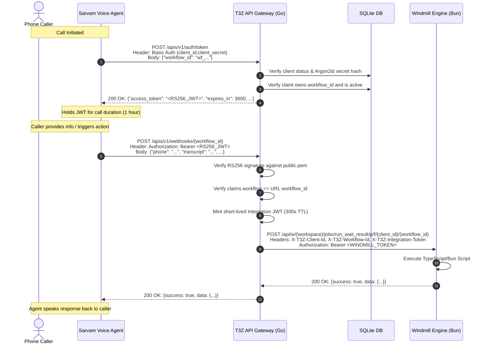

# T3Z API Gateway & Windmill Architecture & Setup Guide

This document outlines the complete architectural design, authentication lifecycle, Windmill workflow execution model, and environment setup instructions for both **Production Server** (`api.t3z.in` / `windmill.t3z.in`) and **Local Development** (`api-dev.t3z.in` / `localhost:8000`).

---

## Table of Contents
1. [Executive Summary & Status](#1-executive-summary--status)
2. [Sarvam Voice Agent Authentication Flow](#2-sarvam-voice-agent-authentication-flow)
3. [Authentication Architecture Details](#3-authentication-architecture-details)
   - [Client Credentials & Password Hashing](#client-credentials--password-hashing)
   - [RS256 JWT Token Issuance (`/apis/v1/auth/token`)](#rs256-jwt-token-issuance-apisv1authtoken)
   - [Token Verification & Workflow Binding](#token-verification--workflow-binding)
   - [Short-Lived Integration Tokens](#short-lived-integration-tokens)
   - [Admin Authentication (Firebase)](#admin-authentication-firebase)
4. [Windmill Execution Flow](#4-windmill-execution-flow)
   - [Workflow Provisioning](#workflow-provisioning)
   - [Webhook Ingestion & Header Injection](#webhook-ingestion--header-injection)
   - [Windmill Upstream Proxy Execution](#windmill-upstream-proxy-execution)
   - [Visual Editor & Local Editing Lifecycle](#visual-editor--local-editing-lifecycle)
5. [Environment Variables Matrix](#5-environment-variables-matrix)
6. [Local Development Setup Guide](#6-local-development-setup-guide)
7. [Production Server Setup Guide](#7-production-server-setup-guide)
8. [End-to-End Verification Examples (cURL)](#8-end-to-end-verification-examples-curl)

---

## 1. Executive Summary & Status

### Is the Authentication Workflow Working?
**YES, 100%.** The authentication system was designed specifically to mirror and upgrade the previous Python backend behavior:
- Clients authenticate via standard **HTTP Basic Auth** (`client_id:client_secret`).
- Tokens are minted as cryptographically signed **RS256 JWTs** using a private RSA key.
- Tokens are strictly bound to a specific `workflow_id`.
- The entire flow has been validated via automated end-to-end integration tests (`TEST_10` through `TEST_15` in `test_results.csv`), running successfully with sub-millisecond cryptographic verification.

---

## 2. Sarvam Voice Agent Authentication Flow

When a call starts in a Sarvam voice agent, the agent interacts with the Gateway through a two-phase lifecycle:



---

## 3. Authentication Architecture Details

### Client Credentials & Password Hashing
- **Client ID**: Alphanumeric unique identifier (e.g. `testclient`, `client_sarvam_voice`).
- **Client Secret**: Generated securely with 32 bytes of cryptographic entropy prefixed with `t3z_live_` (e.g., `t3z_live_9a8B7c...`).
- **Storage**: Plaintext secrets are **never stored**. Secrets are hashed with **Argon2id** (memory: 64MB, iterations: 3, parallelism: 2, salt: 16 bytes). Multiple active/rotated secrets are supported in `client_credentials`.

### RS256 JWT Token Issuance (`/apis/v1/auth/token`)
- **Endpoint**: `POST /apis/v1/auth/token`
- **Request Headers**:
  ```http
  Authorization: Basic <base64(client_id:client_secret)>
  Content-Type: application/json
  ```
- **Request Body**:
  ```json
  {
    "workflow_id": "wf_VAxsjaXiHtXh1CO5"
  }
  ```
- **Response**:
  ```json
  {
    "access_token": "eyJhbGciOiJSUzI1NiIsInR5cCI6IkpXVCJ9...",
    "token_type": "Bearer",
    "expires_in": 3600,
    "workflow_id": "wf_VAxsjaXiHtXh1CO5"
  }
  ```

#### RS256 Token Payload (Claims)
```json
{
  "iss": "t3z.in",
  "sub": "<client_id>",
  "aud": ["t3z-api"],
  "workflow": "<workflow_id>",
  "iat": 1726236000,
  "exp": 1726239600,
  "jti": "1726236000000000000"
}
```

### Token Verification & Workflow Binding
When any request reaches `POST /apis/v1/webhooks/{workflow_id}`:
1. The Gateway parses the `Authorization: Bearer <RS256_JWT>` header.
2. Validates RS256 signature using `keys/public.pem`.
3. Asserts standard claims: `iss == "t3z.in"`, `aud == "t3z-api"`, `exp > now`.
4. Asserts custom claim: `claims["workflow"] == workflow_id` from the URL path.
5. If valid, generates an ephemeral **Integration JWT** (TTL 300 seconds, audience `t3z-integrations`) allowing the Windmill script to securely call back into the Gateway.
6. Forwards the request body to Windmill's asynchronous or synchronous execution endpoint:
   `POST /api/w/{workspace}/jobs/run_wait_result/p/f/{client_id}/{workflow_id}`
   with headers:
   - `X-T3Z-Client-Id: {client_id}`
   - `X-T3Z-Workflow-Id: {workflow_id}`
   - `X-T3Z-Integration-Token: {ephemeral_jwt}`
7. Returns the Windmill script result directly to the caller.

When a workflow script in Windmill needs to interact with Gateway integrations (e.g. Google Sheets at `/apis/v1/integrations/google-sheets/values:batchGet`):
- The script passes `Authorization: Bearer <X-T3Z-Integration-Token>`.
- The Gateway verifies the integration token claims (`t3z-integrations` audience) before executing the integration request.

### Admin Authentication (Firebase)
- Admin routes (`/apis/v1/admin/*`) require Firebase ID Tokens issued to superadmin users.
- Verified via `security.FirebaseVerifier` checking public Google x509 certs.

---

## 4. Windmill Execution Flow

### Workflow Provisioning
When an admin or client provisions a workflow:
1. `ClientService.ProvisionWorkflow` generates a random ID: `wf_<16_urlsafe_chars>`.
2. Calls Windmill REST API:
   `POST /api/w/{workspace}/scripts/create`
   Path: `f/<client_id>/<workflow_id>`
   Language: `bun` (TypeScript)
   Content:
   ```typescript
   // T3Z Gateway provisioned workflow
   export async function main(args?: any, payload?: any) {
     return {
       success: true,
       workflow_id: "%s",
       timestamp: new Date().toISOString(),
       data: args || payload || {},
     };
   }
   ```
3. Records entry in SQLite table `client_workflows` with `windmill_path: "f/<client_id>/<workflow_id>"`.
4. Returns the public Webhook URL:
   - Production: `https://api.t3z.in/apis/v1/webhooks/<workflow_id>`
   - Local: `https://api-dev.t3z.in/apis/v1/webhooks/<workflow_id>`

### Webhook Ingestion & Header Injection
When external payloads (e.g., Sarvam call transcripts) hit the Gateway:
1. Gateway wraps the JSON payload into `{ "args": <data>, "payload": <data> }` so Bun main function parameters bind cleanly.
2. Gateway strips hop-by-hop HTTP headers and injects trusted security headers:
   - `X-T3Z-Client-Id: <client_id>`
   - `X-T3Z-Workflow-Id: <workflow_id>`
   - `X-T3Z-Integration-Token: <short_lived_token>`
   - `Authorization: Bearer <WINDMILL_API_TOKEN>`

### Windmill Upstream Proxy Execution
Gateway dispatches an HTTP request to Windmill:
```http
POST {WINDMILL_BASE_URL}/api/w/{WINDMILL_WORKSPACE}/jobs/run_wait_result/p/f/{client_id}/{workflow_id}
```
- Windmill executes the script inside its Bun runtime worker.
- Windmill blocks until completion and streams the JSON response back to the Gateway.
- Gateway returns the status code and response body back to the caller.

### Visual Editor & Local Editing Lifecycle
Workflows can be edited directly via the Windmill Web UI or pulled to your local machine:
1. Pull scripts to local disk: `wmill sync pull --workspace t3z -i "f/<client_id>/*"`.
2. Edit `.bun.ts` code or `.flow.yaml` definitions.
3. Test locally with live reloading: `wmill dev --path f/<client_id>/<workflow_id>`.
4. Push back to server: `wmill sync push --workspace t3z -i "f/<client_id>/*"`.
5. The Gateway immediately routes subsequent webhook executions to the new code without restarts.

---

## 5. Environment Variables Matrix

| Variable | Description | Production Value | Local Development Value |
| :--- | :--- | :--- | :--- |
| `T3Z_PORT` | HTTP port for API Gateway | `8080` (behind reverse proxy) | `8080` |
| `T3Z_PUBLIC_URL` | Base public URL for webhooks | `https://api.t3z.in` | `https://api-dev.t3z.in` |
| `T3Z_DB_PATH` | Path to SQLite database file | `/var/lib/t3z/auth.db` | `./data/auth.db` |
| `T3Z_JWT_PRIVATE_KEY`| Path to RSA Private Key PEM | `/etc/t3z/keys/private.pem`| `./keys/private.pem` |
| `T3Z_JWT_PUBLIC_KEY` | Path to RSA Public Key PEM | `/etc/t3z/keys/public.pem` | `./keys/public.pem` |
| `T3Z_JWT_ISSUER` | JWT Issuer claim (`iss`) | `t3z.in` | `t3z.in` |
| `T3Z_JWT_AUDIENCE` | JWT Audience claim (`aud`) | `t3z-api` | `t3z-api` |
| `T3Z_JWT_TTL_SECONDS`| Lifetime of workflow tokens | `3600` (1 hour) | `3600` |
| `WINDMILL_BASE_URL` | Windmill server REST API URL | `http://127.0.0.1:8000` (or internal container)| `http://127.0.0.1:8000` |
| `WINDMILL_WORKSPACE`| Windmill workspace name | `t3z` | `t3z` |
| `WINDMILL_TOKEN` | Superadmin User API Token | `<prod-windmill-token>` | `<local-windmill-token>` |
| `GOOGLE_OAUTH_*` | Google Sheets OAuth config | *(Production OAuth App)* | *(Dev OAuth App)* |

---

## 6. Local Development Setup Guide

### Prerequisites
- **Go**: 1.22+
- **Podman** or **Docker**
- **Node.js / Bun** (for `wmill` CLI)
- **OpenSSL**

### Step 1: Generate RSA Keys (if not present)
```bash
mkdir -p keys
openssl genrsa -out keys/private.pem 2048
openssl rsa -in keys/private.pem -pubout -out keys/public.pem
```

### Step 2: Start Local Windmill Stack
Windmill runs fully locally with its visual editor via Podman/Docker Compose:
```bash
podman compose -f windmill/podman-compose.yml up -d
# or: docker compose -f windmill/podman-compose.yml up -d
```
Verify containers:
```bash
podman ps
```

### Step 3: Configure Local Windmill Workspace & API Token
1. Open your browser to `http://localhost:8000`.
2. First-time login: `admin@windmill.dev` / `changeme` (set your password).
3. Create a workspace named **`t3z`** (or use `main`).
4. Generate a User API Token:
   - Click your user profile in bottom-left $\rightarrow$ **User settings** $\rightarrow$ **Tokens** $\rightarrow$ **Add Token**.
   - Name it `api-gateway-local` and copy the value.

### Step 4: Configure Local Environment Variables
Create a local `.env` or export in your shell:
```bash
export T3Z_PORT=8080
export T3Z_PUBLIC_URL="https://api-dev.t3z.in"
export WINDMILL_BASE_URL="http://127.0.0.1:8000"
export WINDMILL_WORKSPACE="t3z"
export WINDMILL_TOKEN="<your-copied-windmill-token>"
```

### Step 5: Start Local Tunneling for `api-dev.t3z.in`
Use Cloudflare Tunnel, ngrok, or SSH port-forwarding to route `https://api-dev.t3z.in` to local port `8080`:
```bash
# Cloudflare Tunnel example:
cloudflared tunnel --url http://localhost:8080
# Or ngrok:
ngrok http 8080 --domain api-dev.t3z.in
```

### Step 6: Start API Gateway
```bash
go run ./cmd/server
```
The server will start listening on port `8080`.

### Step 7: Configure `wmill` CLI for Local Workflow Editing
```bash
# 1. Install CLI
npm install -g windmill-cli

# 2. Add local workspace
wmill workspace add local-t3z t3z http://localhost:8000

# 3. Pull workflows for editing
mkdir -p workflows && cd workflows
wmill init
wmill sync pull --workspace t3z

# 4. Live visual editing in browser:
wmill dev --path f/testclient/wf_xxx
```

---

## 7. Production Server Setup Guide

### Architecture
- **Caddy Reverse Proxy**:
  - `https://api.t3z.in` $\rightarrow$ forwards to `127.0.0.1:8081` (Go API Gateway)
  - `https://windmill.t3z.in` $\rightarrow$ forwards to `127.0.0.1:3001` (Windmill Server)
  - Port `8080` is reserved for `code-server` (web IDE)
- **Windmill**: Deployed via rootless container on port `3001`.
- **API Gateway**: Managed via `systemd` listening on `127.0.0.1:8081`.

### Step 1: Systemd Service for API Gateway (`/etc/systemd/system/t3z-gateway.service`)
```ini
[Unit]
Description=T3Z API Gateway
After=network.target

[Service]
Type=simple
User=t3z
WorkingDirectory=/opt/t3z/API-Gateway
ExecStart=/opt/t3z/API-Gateway/bin/gateway
Restart=always
RestartSec=5s

Environment="T3Z_PORT=8081"
Environment="T3Z_PUBLIC_URL=https://api.t3z.in"
Environment="T3Z_DB_PATH=/var/lib/t3z/auth.db"
Environment="T3Z_JWT_PRIVATE_KEY=/etc/t3z/keys/private.pem"
Environment="T3Z_JWT_PUBLIC_KEY=/etc/t3z/keys/public.pem"
Environment="WINDMILL_BASE_URL=http://127.0.0.1:3001"
Environment="WINDMILL_WORKSPACE=t3z"
Environment="WINDMILL_TOKEN=wmill_user_token_..."

[Install]
WantedBy=multi-user.target
```

### Step 2: Caddy Reverse Proxy Configuration (`/etc/caddy/Caddyfile`)
```caddy
# API Gateway
api.t3z.in:443 {
    tls /etc/caddy/certs/api.t3z.in.pem /etc/caddy/certs/api.t3z.in.key

    handle {
        reverse_proxy 127.0.0.1:8081
    }
}

# Windmill UI & Engine
windmill.t3z.in {
    reverse_proxy 127.0.0.1:3001
}
```

---

## 8. End-to-End Verification Examples (cURL)

### 1. Create a Client (Admin Action)
```bash
curl -X POST https://api.t3z.in/apis/v1/admin/clients \
  -H "Authorization: Bearer <FIREBASE_ADMIN_TOKEN>" \
  -H "Content-Type: application/json" \
  -d '{
    "client_id": "sarvam_client_01",
    "client_name": "Sarvam Voice AI Production"
  }'
```
*Output returns the client secret: `t3z_live_abc123...`*

### 2. Provision a Workflow for the Client
```bash
curl -X POST https://api.t3z.in/apis/v1/admin/clients/sarvam_client_01/workflows \
  -H "Authorization: Bearer <FIREBASE_ADMIN_TOKEN>" \
  -H "Content-Type: application/json" \
  -d '{
    "name": "voice_lead_qualification"
  }'
```
*Output returns `workflow_id: "wf_XyZ987..."` and webhook URL.*

### 3. Sarvam Voice Agent Call Start: Obtain JWT Token
```bash
curl -X POST https://api.t3z.in/apis/v1/auth/token \
  -u "sarvam_client_01:t3z_live_abc123..." \
  -H "Content-Type: application/json" \
  -d '{
    "workflow_id": "wf_XyZ987..."
  }'
```
*Response:*
```json
{
  "access_token": "eyJhbGciOiJSUzI1NiIsInR5cCI6IkpXVCJ9...",
  "token_type": "Bearer",
  "expires_in": 3600,
  "workflow_id": "wf_XyZ987..."
}
```

### 4. Sarvam Voice Agent Call Event: Trigger Webhook
```bash
curl -X POST https://api.t3z.in/apis/v1/webhooks/wf_XyZ987... \
  -H "Authorization: Bearer <TOKEN_FROM_STEP_3>" \
  -H "Content-Type: application/json" \
  -d '{
    "call_id": "call_123456",
    "caller_number": "+919876543210",
    "intent": "schedule_callback",
    "preferred_time": "Tomorrow 4 PM"
  }'
```
*Response from Windmill:*
```json
{
  "success": true,
  "workflow_id": "wf_XyZ987...",
  "timestamp": "2026-09-13T14:30:00.000Z",
  "data": {
    "call_id": "call_123456",
    "caller_number": "+919876543210",
    "intent": "schedule_callback",
    "preferred_time": "Tomorrow 4 PM"
  }
}
```
